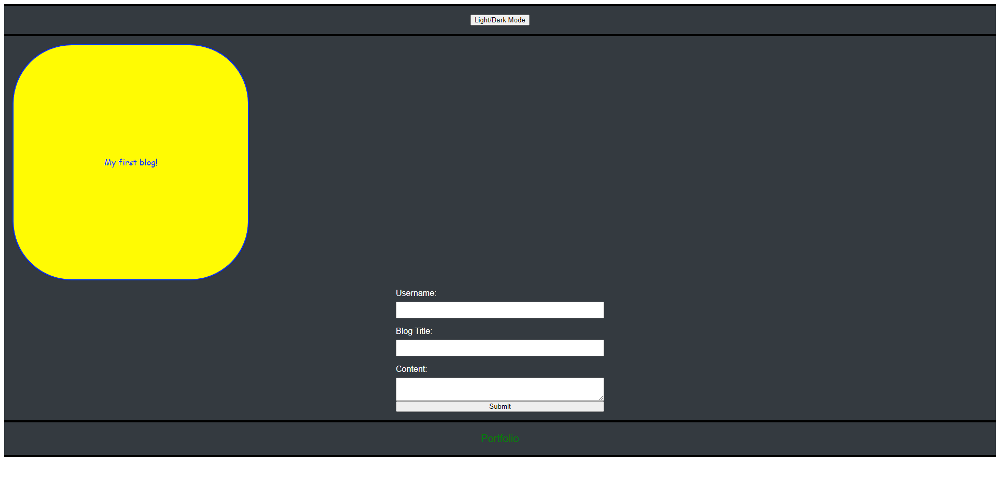
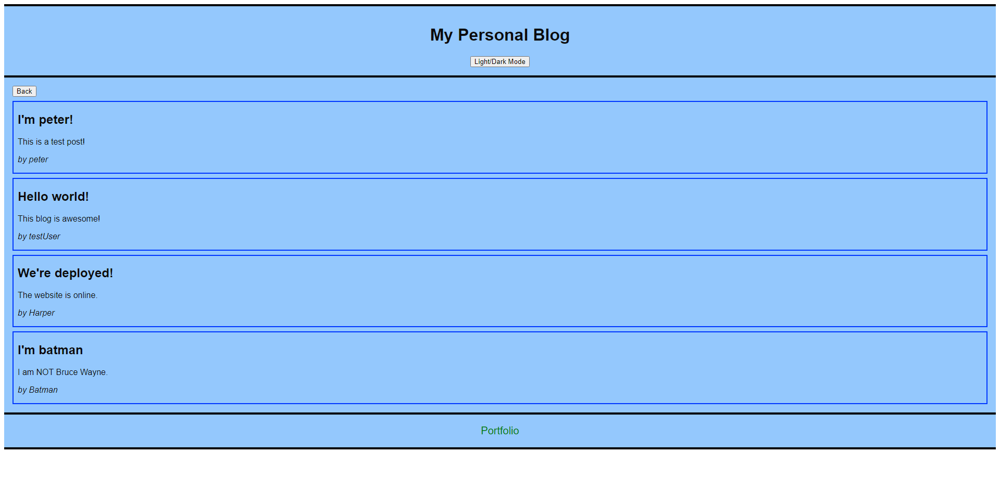

# MY PERSONAL BLOG

## Intro
This project is a two-webpage application that allows the user to enter a username, post title, and input content into a text field. The user input is saved and displayed on the secondary page with the choice of multiple entries.

## Features

- Navigation between pages
- Utilization of localStorage
- Button to switch between light mode and dark mode

## Usage 

- On the landing page, there are three input fields titled Username, Blog Title, and Content.
- After filling the three inputs and clicking the submit button, the user is redirected to another webpage that displays the submitted text in sequential order of information given.
- Clicking on the back button on the secondary webpage will bring the user back to the landing page, enabling the option of submitting another blog post.

## URLs
[Live URL](https://aharper2568.github.io/my-personal-blog/) \
[Github Repo](https://github.com/aharper2568/my-personal-blog)

## Screenshots

## Author and Contributors

HTML and CSS fully coded by **Anthony Harper** 

- [*forEach* method responsible for fetching user input and displaying it on the blog](https://developer.mozilla.org/en-US/docs/Web/JavaScript/Reference/Global_Objects/Array/forEach) 

- [HTML attribute *required* ensuring all fields are filled before submition](https://developer.mozilla.org/en-US/docs/Web/HTML/Attributes/required)

- [*textarea* HTML element that allowed for a bigger input field](https://developer.mozilla.org/en-US/docs/Web/HTML/Element/textarea)
